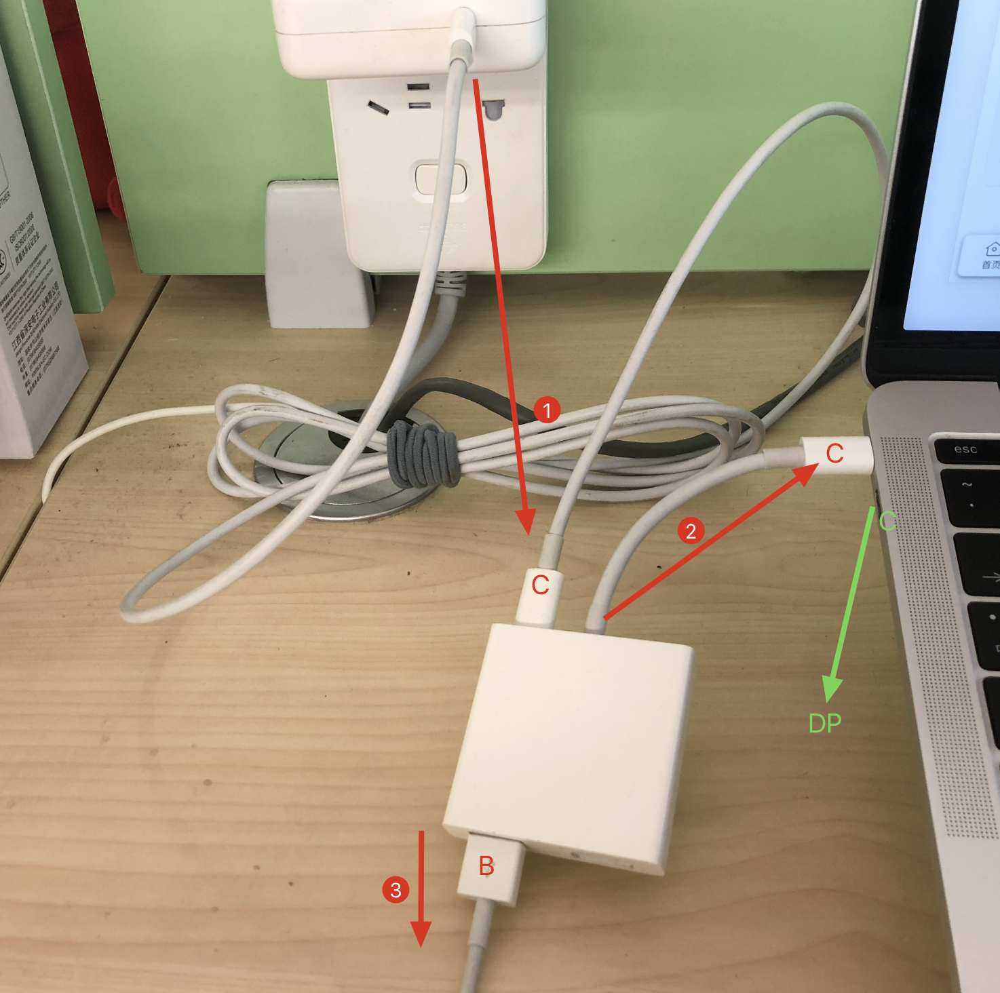

理想中的是一根线解决所有: 电源连接显示器, 显示器用一根线连接电脑, 这根线两端都是同一类型的口, 比如 Type-C, 电脑用这根线给显示器传输音视频可以达到 *4k60hz*, 双端支持 PD 协议, 可以让显示器给电脑供电. 找来找去也就苹果官网的 LG UltraFine 4k 合适, 雷电3的口, 送一根雷电3的线, 但是价格在 5k 以上.

在网上了一堆4k元以下的显示器, 4k60hz Type-C, 有很多, 便宜的显示器输出功率不足以给电脑供电. 很难找到一款合适的显示器.

于是凑合先几百块买了一个1080p显示器, 因为家里还有一个 Air, 要给它做适配. Air有雷电2口, 并且有一个雷电2转VGA的HUB, 也有一个雷电3转HDMI的HUB, 于是两台电脑都用上了1080p.

又从朋友那买了一个 DIY 的显示器, 4k60hz, 有DP口, 也有HDMI口.

于是买了一个 Type-C 转 HDMI 的小米转接器, 糟糕的是 HDMI 是 1.4 版本, 支持到30hz.. 因为电脑只有两个 Type-C 的雷电3口, 要满足充电/连手机/连显示器, HUB 是少不了的. 所以这个 HUB 先留着, 小米商城也没有 Type-C 转 DP 的, 只有转 MiniDP 的, 难不成要买一根 MiniDP-DP 线吗? 发现 HUB 有一个 USB-B 的口, 那么这个 HUB 可以这么用:

电脑插上 HUB, 电源连接 HUB 的 C 口, 这样可以给电脑供电, HUB 的 B 口再连接手机的数据线. 这样电脑会剩余一个 C 口, 再买一根 C-DP 的线就可以了.

2019 年搞一台显示器真的太累了.

- [Type-C / 雷电 3 转接头踩坑记](https://sspai.com/post/54953)
- [ultrafine 4k 入手](https://www.v2ex.com/t/629977)