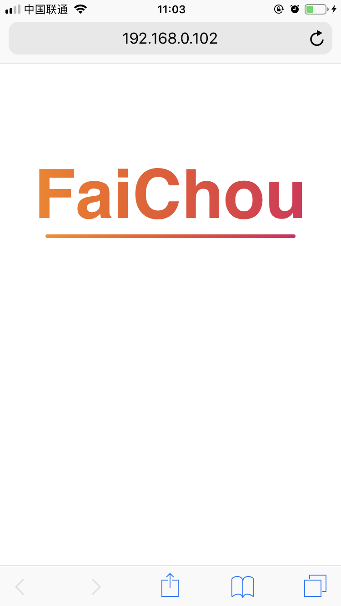

## 字偏上?

```css
.text {
  height: 30px;
  line-height: 30px;
}
```

## 居中

```css
.text {
  text-align: center;
}
```

## 字间距

```css
.text {
  letter-spacing: 2px;
}
```

## 一行显示不开 ...

```css
.text {
  overflow: hidden;
  white-space: nowrap;
  text-overflow: ellipsis;
}
```

## 显示3行 ...

```css
.text {
  display: block;
  display: -webkit-box;
  max-width: 100%;
  height: 43px;
  margin: 0 auto;
  font-size: 14px;
  line-height: 1;
  -webkit-line-clamp: 3;
  -webkit-box-orient: vertical;
  overflow: hidden;
  text-overflow: ellipsis;
}
```

## 颜色渐变 & 下划线



```css
h2 {
  margin-top: 100px;
  font-size: 20vw;
  font-family: 'Poppins', sans-serif;
  background: linear-gradient(to right, #ff8a00 0%, #da1b60 100%);
  -webkit-background-clip: text;
  -webkit-text-fill-color: transparent;
  text-align: center;
  position: relative;
}
h2::after {
  position: absolute;
  content: '';
  bottom: -4px;
  left: 50px;
  right: 50px;
  height: 4px;
  border-radius: 2px;
  background: linear-gradient(to right, #ff8a00 0%, #da1b60 100%);
}
```
