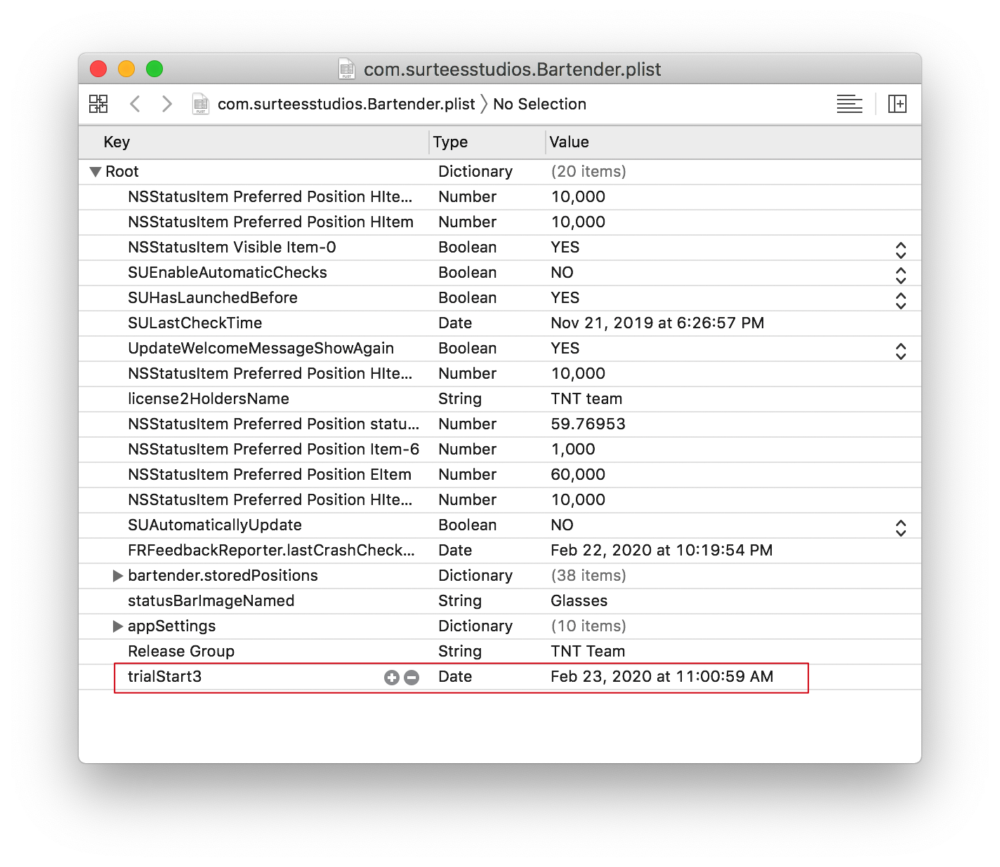
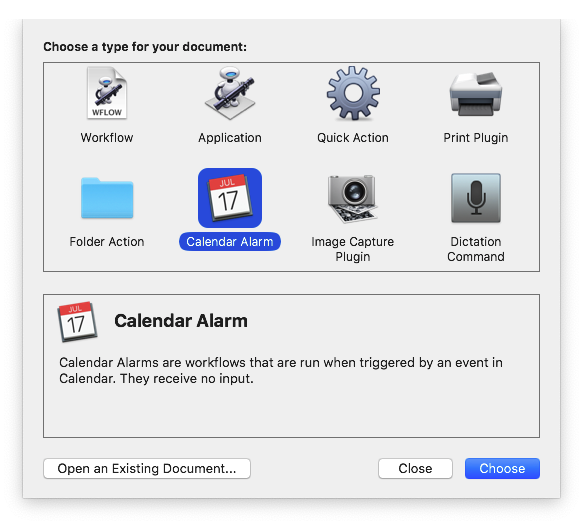
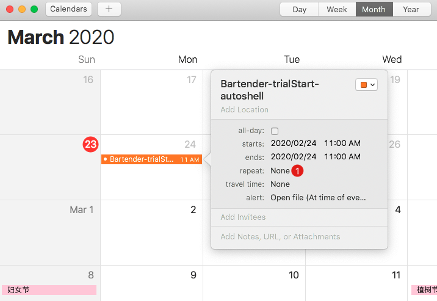

介绍不想再啰嗦, 可以看少数派这篇: [Automator 简单介绍及入门玩法](https://sspai.com/post/36667).

> Keyboard Maestro ，Automator ，Workflow 都是同一类型的软件，都能够帮助我们这种「懒」人自动的去完成一些操作.

之前有群友分享过一个使用案例: 针对 Bartender 的 pojp 方法, 使用 KM 来定期执行一段脚本, 改变安装日期来延长使用期限, 这样就可以达到无限期使用.

其实要完成这类工作需要具备三个条件:

1. 软件有一定免费使用期限
2. 可以用脚本来改变安装日期
3. 设定定时任务, 每周执行脚本

## 使用期限

MacOS 下有很多可以免费试用的软件, 比如 Bartender, 这类软件基本都是有一个文件(plist)保存这个过期时间/安装时间的字段, 一般情况下在 `~/Library/Preferences` 目录下, 找到对应的 plist 文件, 可以看到有一个类似: `expiredDate` `installDate` `trialDate` `launchDate` 等.



## 编写脚本

```
$ defaults write com.xxx.APPNAME FIELD -date `TZ=UTC date "+%Y-%m-%dT%H:%M:%SZ"`s
```

以上脚本会把对应的字段重置为当前时间.

## 自动执行

打开 Automator 软件, 选择 *Calendar Alarm*, 这样编写的动作在保存时候可以导出到日历, 用来下一步派发事件.



在最左侧 Actions 栏, 选择 `Utilities`, 然后再找到 `Run Shell Script`, 将脚本写过去. 可以点击右上角 Run 来执行测试一下.

`Command+S` 保存这个动作, 起一个名字, 之后会弹出日历.

将事件拖放到未来某一天, 双击事件, 在弹出框里点击日期栏会展开, 然后选择 repeat 栏目下的重复周期, 可以设置每周执行一次, 每月执行一次等.



## End

至此, 一个自动执行的 workflow 就完成了, 当然 Automator 的功能远不止这些, 但本文近给出一个简单的使用场景, 如果以后遇到类似的问题, 可以尝试用「扛炮」来解决.