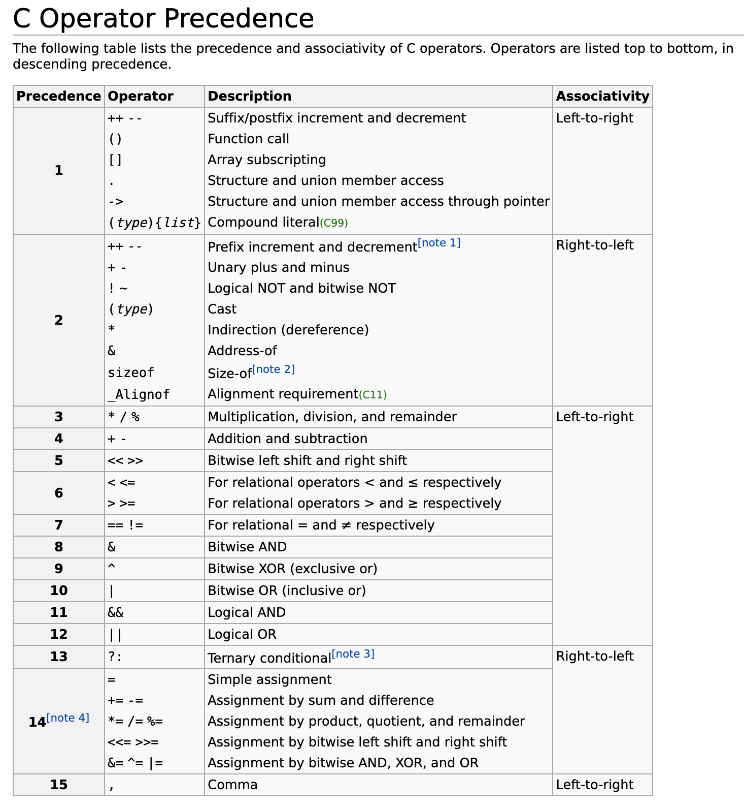

下面是跟着[Jacob Sorber](https://www.youtube.com/@JacobSorber)老师学习的一些经验总结。


## 1. C 语言中的字符串

C 语言中的字面量字符串是无法直接修改的，比如 `char *s = "abc";` 这里无法通过 `s[1] = 'B';` 来修改，因为字符串会被存储在程序的只读数据段中。

要想修改有下面两种方法：

#### 1. 使用数组

```
char a[] = "abc";
```

这样数组里每个元素是一个字符，可以修改。

#### 2. 使用malloc分配内存

```
char *s = malloc(4);  // 分配足够的空间来存储 "abc" 和终止字符 '\0'
strcpy(s, "abc");
s[0] = 'd';  // 可以修改
// 记得最后释放内存
free(s);
```

当使用 `char s[] = "abc";` 的形式声明一个字符数组并初始化它，编译器会在栈（Stack）上为数组 `s` 分配一块可读写的内存空间，并把字符串字面量 "abc" 的内容（包括终止字符 '\0'）复制到这块内存中。

字符串字面量 "abc" 本身确实是存储在只读数据段中，但是这里的关键点是编译器为数组 `s` 创建了一份这个字符串的拷贝，并存储在栈上，这是一个可读写的内存区域。
因此，对数组 `s` 的任何修改都是合法的，不会导致未定义行为。

这与直接使用字符指针指向一个字符串字面量（例如 `char *s = "abc";`）是不同的，后者会导致字符串指针指向只读数据段。


## [线程与互斥锁问题](https://www.youtube.com/watch?v=9axu8CUvOKY&list=PL9IEJIKnBJjFZxuqyJ9JqVYmuFZHr7CFM&index=3)

有一个特别繁重的函数:

```c
#define BIG 1000000000UL
uint32_t counter = 0;
void *count_to_big(void *arg) {
  for (uint32_t i = 0; i < BIG; ++i) {
    counter++;
  }
  return NULL;
}
int main() {
  count_to_big();
  count_to_big();
}
```

这样执行需要一次 `count_to_big` 需要 5 秒，那执行两次则需要 10 秒。

那么是否可以新增线程来同步计算？

```c
int main() {
  pthread_t t;
  pthread_create(&t, NULL, count_to_big, NULL);
  count_to_big(NULL);
  pthread_join(&t, NULL); // wait for thread end
}
```

这样执行后会出现两个问题，第一是计算有误，第二是执行时间更长了。

先解决第一个问题，可以加互斥锁:

```c
pthread_mutex_t lock = PTHREAD_MUTEX_INITIALIZER;
void *count_to_big(void *arg) {
  for (uint32_t i = 0; i < BIG; ++i) {
    pthread_mutex_lock(&lock);
    counter++;
    pthread_mutex_unlock(&lock);
  }
  return NULL;
}
```

这样执行结果就是正确的了。

来看第二个执行时间变长的问题，为什么执行时间变长了呢？因为每次线程切换都需要耗时，能否解决？不能。

## 2. pthread_mutex_lock & pthread_cond_wait

在[这一章节中](https://www.youtube.com/watch?v=FMNnusHqjpw&list=PL9IEJIKnBJjFZxuqyJ9JqVYmuFZHr7CFM&index=6)，老师创建了 20 个线程来处理网络收到的请求，每个线程的核心代码:

```c
void *thread_function(void *arg) {
  while (true) {
    int *pclient = dequeue();
    if (pclient != NULL) {
      handle_connection(pclient);
    }
  }
}
```

但这样有一个很明显的问题，就是 queue 中的数据不是 thread safe，也就是称为的原子性。多个线程同时访问这个 queue 就会出问题。

所以解决方法就是加互斥锁:

```c
pthread_mutex_t mutex = PTHREAD_MUTEX_INITIALIZER;

void *thread_function(void *arg) {
  while (true) {
    int *pclient;
    pthread_mutex_lock(&mutex);
    pclient = dequeue();
    pthread_mutex_unlock(&mutex);
    if (pclient != NULL) {
      handle_connection(pclient);
    }
  }
}

int main() {
  // ...
  while (true) {
    int *pclient = malloc(sizeof(int));
    *pclient = client_socket
    pthread_mutex_lock(&mutex);
    enqueue(pclient);
    pthread_mutex_unlock(&mutex);
  }
  // ...
}
```

现在另一个问题出现了，在空闲的时候，`while (true)` 一直在跑，特别吃 cpu，所以有一个简单方法:

```c
void *thread_function(void *arg) {
  while (true) {
    int *pclient;
    pthread_mutex_lock(&mutex);
    pclient = dequeue();
    pthread_mutex_unlock(&mutex);
    if (pclient != NULL) {
      handle_connection(pclient);
    } else {
      sleep(1);
    }
  }
}
```

这个解决方法会让线程处理变慢，因为它要让线程休息 1 秒，如果将这个 1 秒变成 0.5 秒甚至更低，这样 cpu 又会变得繁重。有没有什么方法可以让循环暂停，等待通知来继续呢？可以使用 `condition variable`。

```c
pthread_cond_t condition_var = PTHREAD_COND_INITIALIZER;

void *thread_function(void *arg) {
  while (true) {
    int *pclient;
    pthread_mutex_lock(&mutex); // 在调用 pthread_cond_wait 之前，需要获得与之相关联的互斥锁
    pthread_cond_wait(&condition_var, &mutex);
    pclient = dequeue();
    pthread_mutex_unlock(&mutex);
    if (pclient != NULL) {
      handle_connection(pclient);
    }
  }
}

int main() {
  // ...
  while (true) {
    int *pclient = malloc(sizeof(int));
    *pclient = client_socket
    pthread_mutex_lock(&mutex);
    enqueue(pclient);
    pthread_cond_signal(&condition_var);
    pthread_mutex_unlock(&mutex);
  }
  // ...
}
```

这样 `pthread_cond_wait` 可以让程序暂停(suspended)，也就是阻塞线程，直到 `pthread_cond_signal` 唤醒，也就是程序中来到新的请求后。

上面代码中有一个重要的点，在 `thread_function` 中使用 `pthread_mutex_lock` 锁住了 queue 中数据，那在 `main` 中是不是无法再次 enqueue 了？答案是否定的，因为 `pthread_cond_wait` 在阻塞线程时候会自动解锁其参数中给出的互斥锁，也就是第二个参数 `&mutex`。这使得其他 `main` 有机会获得互斥锁并修改共享资源(queue)。当 `pthread_cond_signal` 被调用并且 `pthread_cond_wait` 因此返回时，互斥锁再次被当前线程（`thread_function` 线程）锁定。

这样就是完美了吗？没有的，代码还是有问题，如果同时到来很多请求，每一个线程都在忙，此时多余的请求会被 `enqueue` 同时也会继续发送 `pthread_cond_signal`，由于没有闲置的线程来处理 signal，则 signal 将会丢失。这样在 queue 中的待处理任务则不会被后续处理。

所以解决方法是在 `thread_functioh` 中先提前 `dequeue`，只有当 queue 空时候再阻塞:

```c
void *thread_function(void *arg) {
  while (true) {
    int *pclient;
    pthread_mutex_lock(&mutex);
    if ((pclient = dequeue()) == NULL) {
      pthread_cond_wait(&condition_var, &mutex);
      pclient = dequeue(); // try again
    }
    pthread_mutex_unlock(&mutex);
    if (pclient != NULL) {
      handle_connection(pclient);
    }
  }
}
```

## 3. C 语言指针陷阱，函数参数是一份外部的拷贝

在c语言中，函数调用后，函数的参数也是在栈中。函数调用结束，参数会出栈，释放掉。

比如：

```c
void foo(int a) {
  printf("%d", a);
}
int x = 3;
foo(x); 
```

这样 `x` 在栈中，调用 `foo` 时候，参数 `a` 获得了一份拷贝，也是在栈中。函数调用结束，`a` 被释放。

如果是指针:

```c
void bar(int *a) {
  *a = 4;
}
int *y = &x;
bar(y);
```

这样 `y` 在栈中，它是一个指针，存储了 `x` 的地址，调用 `bar` 时候，参数 `a` 也是在栈中，获得了一份 `y` 的拷贝，`a` 也是存储了 `x` 的地址。所以使用 `*a` 可以改变 `x` 的值。

要想更改 `y`，则需要 `int **p_y` 这样的参数，以及这样的调用 `bar(&y)`。

同样在链表中

```c
node_t *insert_at_head(node_t *head, node_t *node_to_insert) {
  node_to_insert->next = head;
  return node_to_insert;
}

head = insert_at_head(head, tmp);
```

同样可以写成:

```c
void insert_at_head(node_t **head, node_t *node_to_insert) {
  node_to_insert->next = *head;
  *head = node_to_insert;
}

insert_at_head(&head, tmp);
```

这里有一个问题:

```c
void free_all_nodes(node_t *head) {
  while (head != NULL) {
    node_t *temp = head;
    head = head->next;
    free(temp);
  }
}
```

这个函数看起来没有问题，但是使用时候:

```c
free_all_nodes(head);
```

这样就有一个陷阱，虽然所有的链表被释放掉了，但是外部的 head 仍然保存着原来的地址，这个地址已经被释放了，所以它变成了悬空指针。如果继续访问的话会有危险，最好是手动值为 NULL:

```c
free_all_nodes(head);
head = NULL;
```

## 4. 为什么这个链表中不要内存释放

老师在[这一章节](https://www.youtube.com/watch?v=KFbm6lkMhgw&list=PL9IEJIKnBJjFiudyP6wSXmykrn67Ykqib&index=2)实现了一个链表结构，但是并没有写它的释放逻辑：

```c
void remove_node(node_t **head, node_t *node_to_remove) {
  if (*head == node_to_remove) {
    *head = node_to_remove->next;
    if (*head != NULL) {
      (*head)->prev = NULL;
    }
  } else {
    node_to_remove->prev->next = node_to_remove->next;
    if (node_to_remove->next != NULL) {
      node_to_remove->next->prev = node_to_remove->prev;
    }
  }
  node_to_remove->next = NULL;
  node_to_remove->prev = NULL;
  // free(node_to_remove); // why?
}
```

以及所有的链表在使用完没有进行 `free_all_nodes`, 比如我写了一个 `free_all_nodes` 函数:

```c
void free_all_nodes(node_t **head) {
  while (*head != NULL) {
    node_t *temp = *head;
    *head = (*head)->next;
    free(temp);
  }
  *head = NULL;
}
```

后来在讨论中发现，这不是老师忘记释放内存了，是因为 node 的创建不一定是由 `create_new_node` 创建在 heap 上，也有可能是在 stack 中。


## 5. 哈希表的逻辑

链表在做查询增加删除时候是非常慢的(`O(n)`)，因为需要遍历节点。
但是[哈希表](https://www.youtube.com/watch?v=2Ti5yvumFTU&t=1159s)是通过哈希函数将键映射到数组的索引上，这样就能在 `O(1)` 时间内找到对应的节点。
除了搜索会变快（如果只有检索变快，那用数组也是一样的），进行插入和删除也是高效的，数组在插入和删除也是很慢的。

首先实现一个简单的哈希函数（故意设置成这样，简单的数据即可碰撞相同结果）:

```c
unsigned int hash(char *name) {
  int l = strnlen(name, MAX_NAME);
  unsigned int hash_value = 0;
  for (int i = 0; i < l; ++i) {
    hash_value += name[i];
    hash_value = (hash_value * name[i]) % TABLE_SIZE;
  }
  return hash_value;
}
```

初始化哈希表:

```c
person *hash_table[TABLE_SIZE];
void init_hash_table() {
  for (int i = 0; i < TABLE_SIZE; i++) {
    hash_table[i] = NULL;
  }
}
```

第一个版本的插入检索删除:

```c
bool hash_table_insert(person *p) {
  if (p == NULL) return false;
  int index = hash(p->name);
  if (hash_table[index] != NULL) {
    return false;
  }
  hash_table[index] = p;
  return true;
}

person *hash_table_lookup(char *name) {
  int index = hash(name);
  if (hash_table[index] != NULL && strncmp(hash_table[index]->name, name, MAX_NAME) == 0) {
    return hash_table[index];
  }
  return NULL;
}

person *hash_table_delete(char *name) {
  int index = hash(name);
  if (hash_table[index] != NULL && strncmp(hash_table[index]->name, name, MAX_NAME) == 0) {
    person *tmp = hash_table[index];
    hash_table[index] = NULL;
    return tmp;
  }
  return NULL;
}
```

这样一个简单的哈希表就做好了，但经过测试发现，有一些数据无法存储，因为不同的数据产生了相同的哈希结果，这叫 collision。
如何结果 collision 呢？
有开放寻址法（Open Addressing）和链地址法（Separate Chaining）等方法，我们才用开放寻址法，并且使用线性探测（Linear Probing）来解决，发生冲突时，在哈希表中从冲突位置开始，按照一定的步长（通常是1）线性查找，直到找到一个空槽。

现在有了版本2:

```c
bool hash_table_insert(person *p) {
  if (p == NULL) return false;
  int index = hash(p->name);
  for (int i = 0; i < TABLE_SIZE; ++i) {
    int try = (i + index) % TABLE_SIZE;
    if (hash_table[try] == NULL) {
      hash_table[try] = p;
      return true;
    }
  }
  return false;
}

person *hash_table_lookup(char *name) {
  int index = hash(name);
  for (int i = 0; i < TABLE_SIZE; ++i) {
    int try = (i + index) % TABLE_SIZE;
    if (hash_table[try] != NULL && strncmp(hash_table[try]->name, name, MAX_NAME) == 0) {
      return hash_table[try];
    }
  }
  return NULL;
}

person *hash_table_delete(char *name) {
  int index = hash(name);
  for (int i = 0; i < TABLE_SIZE; ++i) {
    int try = (i + index) % TABLE_SIZE;
    if (hash_table[try] != NULL && strncmp(hash_table[try]->name, name, MAX_NAME) == 0) {
      person *tmp = hash_table[try];
      hash_table[try] = NULL;
      return tmp;
    }
  }
  return NULL;
}
```

这样就解决了冲突问题，但这样又迎来了性能问题，比如检索一个不存在的 name，那么将会遍历整个列表。
能否优化一下呢？可以的，让我们想一下这个哈希表的结构，当一个数据获取哈希后，将哈希值当索引存入列表，当另一个碰撞的数据也存入时候，是会往下寻找空槽。这样是不是可以确定，如果一个数据在哈希位置的地方找不到，那它就是没有呢？不是的，因为有 delete 函数，将其删掉后，位置也是空的。所以这里可以优化一下，如果删掉后，不要置空，而是指向另外一个特殊的值，这样只要相同的哈希值，则一定不是空，即使被删，也是特殊值。如果哈希值位置是空，则可以确定哈希表中不存在这条数据。

最终版本如下:

```c
#define DELETED_NODE (person *)(0xFFFFFFFFFFFFFUL)
bool hash_table_insert(person *p) {
  if (p == NULL) return false;
  int index = hash(p->name);
  for (int i = 0; i < TABLE_SIZE; i++) {
    int try = (i + index) % TABLE_SIZE;
    if (hash_table[try] == NULL || hash_table[try] == DELETED_NODE) {
      hash_table[try] = p;
      return true;
    }
  }
  return false;
}

person *hash_table_lookup(char *name) {
  int index = hash(name);
  for (int i = 0; i < TABLE_SIZE; ++i) {
    int try = (index + i) % TABLE_SIZE;
    if (hash_table[try] == NULL) return NULL;
    if (hash_table[try] == DELETED_NODE) continue;
    if (strncmp(hash_table[try]->name, name, MAX_NAME) == 0) {
      return hash_table[try];
    }
  }
  return NULL;
}

person *hash_table_delete(char *name) {
  int index = hash(name);
  for (int i = 0; i < TABLE_SIZE; ++i) {
    int try = (index + i) % TABLE_SIZE;
    if (hash_table[try] == NULL) return NULL;
    if (hash_table[try] == DELETED_NODE) continue;
    if (strncmp(hash_table[try]->name, name, MAX_NAME) == 0) {
      person *tmp = hash_table[try];
      hash_table[try] = DELETED_NODE;
      return tmp;
    }
  }
  return NULL;
}
```


## 6. Makefile

当 GCC 遇到 .c 文件时，它会执行预处理、编译、汇编和链接四个步骤，除非你特别指定只做某个阶段（例如，使用 -c 选项只编译但不链接）。

当 GCC 遇到 .o（对象）文件时，它知道这些文件已经经过了编译和汇编，因此只需进行链接。

当 .c 和 .o 文件同时出现时，GCC 会先将 .c 文件预处理、编译、汇编成 .o 文件，然后将所有的 .o 文件链接成一个可执行文件。

```
gcc -c main.c
gcc -o main main.c
gcc -c -o my_object.o main.c
gcc -o my_program foo.o bar.o
```

第一条会编译成 main.o，不进行链接。
第二条会编译链接生成 main 可执行文件。
第三条会编译 main.c 并生成一个名为 my_object.o 的目标文件。
第四条会链接 foo.o 和 bar.o 生成 my_program 程序。

在 Makefile 中，`$@` 代表目标文件名，`$^` 会展开依赖文件，`$<` 表示所有依赖文件中的第一个。

看下面这个完整例子:


```
my_project/
|-- main.c
|-- main.h
|-- foo.c
|-- foo.h
|-- Makefile
```

```
CC = gcc
CFLAGS = -Wall

TARGET = my_program
SRC = main.c foo.c
OBJ = $(SRC:.c=.o)

all: $(TARGET)

$(TARGET): $(OBJ)
    $(CC) $(CFLAGS) -o $@ $^

%.o: %.c %.h
    $(CC) $(CFLAGS) -c $< -o $@

clean:
    rm -f $(OBJ) $(TARGET)
```

`$(SRC:.c=.o)` 会展开成 `main.o foo.o`。
`%.o: %.c %.h` 表示匹配所有的 `.o .c .h` 文件，比如 `$(TARGET): $(OBJ)` 展开后是 `myp_grogram: main.o foo.o`，但是项目中没有，则会去找 ``%.o: %.c %.h` 这条去生成。

## 7. 静态库动态库

#### 静态库 (.a, .lib)

.a：用于 Unix 和 Unix-like 操作系统（如 Linux 和 macOS）的静态库文件。生成命令: `ar rcs libmylibrary.a file1.o file2.o`。

.lib：在 Windows 平台上，这通常是静态库文件。生成命令: `lib /OUT:mylibrary.lib file1.obj file2.obj`。


#### 动态库 (.so, .dylib)

.so：这是 Linux 和其他 Unix-like 操作系统的动态链接库（Shared Object）。生成命令: `gcc -shared -o libmylibrary.so file1.o file2.o`。

.dylib：这是 macOS 特有的动态库。生成命令: `gcc -dynamiclib -o libmylibrary.dylib file1.o file2.o`。


静态库在链接时，库中的代码会被复制到最终的可执行文件中。这会使得可执行文件变大，但它是自包含的，不依赖于外部库。
动态库在链接时不会将代码复制到可执行文件中。运行时，可执行文件会查找动态库并动态地链接。这样可以减小可执行文件的大小，但如果动态库不存在或版本不匹配，程序将无法运行。


#### 例子

假设有一个 foo.h 头文件，内容如下：

```c
// foo.h
#ifndef FOO_H
#define FOO_H

void say_hello();

#endif
```

以及一个 foo.c 源文件，内容如下：

```c
// foo.c
#include "foo.h"
#include <stdio.h>

void say_hello() {
    printf("Hello, world!\n");
}
```

生成静态库（Unix-like 系统）:

1. 编译 `foo.c` 为目标文件 `foo.o`: `gcc -c foo.c -o foo.o`
2. 生成 `.a` 静态库: `ar rcs libfoo.a foo.o`

生成动态库（Unix-like 系统）:

1. 编译 `foo.c` 为共享目标文件：`gcc -fPIC -c foo.c -o foo.o`
2. 生成 `.so` 动态库: `gcc -shared -o libfoo.so foo.o`

在分发库文件（例如`libfoo.a`或`libfoo.so`）时，也应该分发`foo.h`头文件。这样，其他开发者可以通过包含这个头文件并链接到相应的库，来使用 `say_hello` 函数。


## C 语言操作符优先级

先看下面这几个语句:

```c
++p->a
p++->a
p->a[3]
*p->a
*p++
```

用括号表示其优先级是这样的:

```c
++(p->a)
(p++)->a
(p->a)[3]
*(p->a)
*(p++)
```

可以通过查表: [C Operator Precedence](https://en.cppreference.com/w/c/language/operator_precedence)，看到第一优先级的 `->`, `++ --` 和 `[]` 在同一梯队，注意这里的 `++ --` 是后缀，不是前缀。

而作为前缀的 `++ --` 则是在第二梯队，和 `*` 在同一梯队。

第一梯队是从左至右计算的，第二梯队是从右至左计算的。

所以第一个 `++p->a` 前缀 `++` 优先级低于 `->`，结果是 `++(p->a)`。
第二个 `p++->a` 后缀 `++` 优先级和 `->` 相等，由于是从左到右，所以结果是 `(p++)->a`。
第三个 `p->a[3]` 中 `[]` 优先级和 `->` 一样，由于是从左到右，所以结果是 `(p->a)[3]`。
第四个 `*p->a` 中 `*` 优先级低于 `->` 所以结果是 `*(p->a)`。
第五个 `*p++` 中后缀 `++` 和 `*` 优先级相同，由于是从右至左，所以结果是 `*(p++)`。



## A better hashtable

在[这一章节中](https://www.youtube.com/watch?v=KI_V91UdL1I&list=PL9IEJIKnBJjFiudyP6wSXmykrn67Ykqib&index=22)，Jacob 老师实现了一个更 general 的 hashtable，前面章节有一个漏掉的知识点，使用链表搭配 Hashtable 来处理碰撞问题，具体实现逻辑可以[在这里](https://github.com/FaiChou/c-tutorial/blob/main/hashtable_ll.c)查看。

这一章节的知识点:

1. 如果实现一个规范的库，.h 里定义暴露出去的方法和类型，.c 里包含方法的实现，以及不需要暴露出去的方法使用 static 修饰。
2. Makefile 怎么写，规范库中需要包含 test 文件，如何打包静态库和动态库等。
3. 在 .h 中用到的类型: `typedef struct _hash_table hashtable;` 则在 .c 中只需要实现 `struct _hash_table {};`
4. 参数传递函数，使用 `typedef uint64_t (hashfunction) (const char *, size_t);` 然后 `size_t foo(hashfunction *hf)`
5. `strdup` 来替代 `malloc() + strcpy()` 初始化一个字符串的副本。
6. `strcspn` 用来查找一个字符串中第一个出现在另一个给定字符串中的字符的位置。
7. cleanup 的作用

#### cleanup 的作用

在 hashtable 的实现中，最后需要释放空间防治内存泄露，但有些内存不一定是在 heap 中，所以到底应不应该释放取决于具体的实现。
这时候就需要传递一个 cleanup 函数来让调用者决定如何释放这些内存:

```c
typedef void cleanupfunction(void *);
hash_table *hash_table_create(uint32_t size, hashfuncion *hf, cleanupfunction *cf);

hash_table *hash_table_create(uint32_t size, hashfuncion *hf, cleanupfunction *cf) {
  // ...
  if (cf) {
    ht->cleanup = cf;
  } else {
    hf->cleanup = free;
  }
}
```

当然上述 `typedef` 也可以改成:

```c
typedef void (*cleanupfunction)(void *);
hash_table *hash_table_create(uint32_t size, hashfuncion *hf, cleanupfunction cf);

hash_table *hash_table_create(uint32_t size, hashfuncion *hf, cleanupfunction cf) {
  // ...
  if (cf) {
    ht->cleanup = cf;
  } else {
    hf->cleanup = free;
  }
}
```

#### hashtable 的结构

```c
typedef struct entry {
  char *key;
  size_t keylength;
  void *object;
  struct entry *next;
} entry;

struct _hash_table {
  uint32_t size;
  hashfunction *hash;
  entry **elements;
}
```

为什么是 `entry **elements;`? 因为在 heap 上创建的数据只能用 pointer 来代表，要创建一个列表，则通过 `entry **` 来代表（或者`entry *elements[]`）更明确地表达了“这是一个数组”的意图。


## GDB debug

首先使用 GDB 调试前，需要在编译时候使用 `-g` 标志让编译器生成带有调试信息的可执行文件。这样，gdb 才能正确地映射到源代码的行号、变量名等信息，使得更方便地进行调试。

常用命令:

1. run 或者 r 来启动程序
2. continue 或者 c 从当前停止处继续运行程序
3. kill 终止当前调试的程序
4. quit 或 q 退出 gdb
5. help 显示帮助信息
6. break 或 b 设置断点，比如 b main (main函数) 或者 b 12 (12行)
7. info breakpoints 或 info b 列出所有设置的断点
8. delete 删除断点，例如，delete 1 删除编号为 1 的断点。也可以删除 watch
9. step 或 s: 执行下一行代码，如果有函数调用则进入函数，比如 foo() 执行 step 会进入 foo 内部停住
10. next 或 n: 执行下一行代码，跳过函数调用，比如 foo() 执行 next 会直接执行完 foo() 到下一行
11. finish: 从当前函数中退出
12. print 或 p: 打印表达式的值。例如，print x 打印变量 x 的值
13. watch: 设置观察点，当观察的变量值改变时停止执行
14. list 或 l: 显示源代码
15. x 命令用于“examine”检查内存中的内容，`x/[数量][格式][大小] 地址`，比如查看一个以十六进制表示的单一字节：`x/bx ptr`
16. Conditional Breakpoints: `watch count if count > 10` `break a.c:30 if (x > 25)` and so on
17. backtrace 或 bt 显示调用堆栈
18. frame 或 f: 选择堆栈帧。例如，frame 2 切换到编号为 2 的堆栈帧


lldb（LLVM Debugger）和 GDB 一样用于调试，除了 C 和 C++，还支持 Objective-C 和 Swift。

Valgrind 是一个用于内存调试、内存泄露检测和性能分析的开源工具。`valgrind ./my_program` 会运行 `my_program` 并报告各种内存问题。
