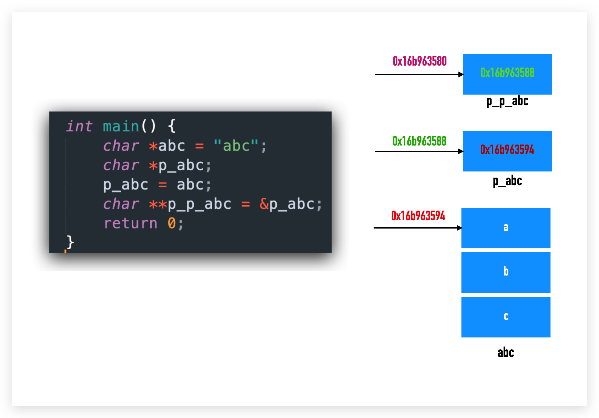

## 指针是什么?

指针就是地址. 一个 `8 bytes` (在64位电脑下)的内存数据.

## 指针的意义是什么?

> 授予，存储一个值的这个变量本身以外的代码组分，对这个值的访问，修改权。
> 传指针，逻辑上就是一个授权，传了一个权利。
> 链表的节点。靠着这个权利，存储了对左右邻居的访问和修改权。
> 函数通过传指针，获取了外面一些变量的访问和修改权。
> 如果传值，只能获取访问权，不能获得修改权。

## `char *` 指针

```c
char *s = "abc";
```

实际上是 `const char *s`, 因为 `abc` 数据是 *readonly* 的. 

`s` 是字符串 `abc` 中 `a` 的地址, 可以用 `s[1], s[2]` 这种数组形式来访问字符 `b` 和字符 `c`.

相同的, `char s[]` 这里的 s 是数组名, 也是指针, 指向数组第一个元素的地址, 也可以用指针偏移来访问数据 `*(s+1)`.

## 二级指针

它也是指针, 它的地址是另一个指针的地址:

```c
int a = 1;
int *pa = &a;
int **ppa = &a;
```



## 为什么这段代码是不对的?

```c
#include <stdio.h>
int main() {
    char **s;
    *s = "abc";
    printf("%s\n", *s);
    return 0;
}
```

通过编译:

```bash
$ gcc -Wall -Wextra -Werror -ansi -pedantic -pedantic-errors -fsanitize=address,undefined a.c
```

可以发现警告:

```
a.c:6:6: warning: variable 's' is uninitialized when used here [-Wuninitialized]
    *s = "abc";
     ^
a.c:5:13: note: initialize the variable 's' to silence this warning
    char **s;
            ^
             = NULL
1 warnings generated.
```

指针 `s` 没有初始化就被用了.

所以正确的写法应该是:

```c
int main() {
    char **s;
    s = (char **)malloc(sizeof(char *));
    *s = "abc";
    printf("%s\n", *s);
    free(s);
    return 0;
}
```

## char **

`char **` 这种写法指的是指向指针的指针, 当然也可以算做指向一个字符串数组的指针, 比如:

```c
char *a[] = {"abc", "def"};
char **s = a;
```

如何正确初始化一个具有两个字符串的 `char **` ?

```c
char **s = malloc(sizeof(char *) * 2);
*s = (char *)malloc(sizeof(char) *4);
s[1] = malloc(sizeof(char) *4);
strncpy(s[0], "a32q", 4);
strncpy(*(s+1), "defg", 4);
printf("%c\n", *s[0]); // print a
printf("%c\n", **s); // print a
printf("%c\n", s[0][1]); // print 3
printf("%c\n", *(*s+1)); // print 3
printf("%c\n", *(*s+2)); // print 2
printf("%c\n", *s[1]); // print d
printf("%c\n", **(s+1)); // print d
printf("%c\n", **(s+1)+2); // print f
printf("%c\n", **(s+1)+9); // print m
```

## 使用 char ** 解构 argv

```c
for (char **p; *p != NULL; p++) {
    printf("%s\n", *p);
}
```
