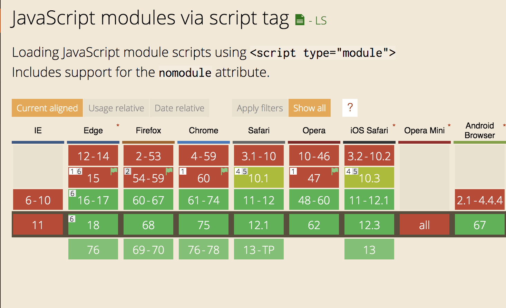

## 原文地址

[Introduction to ES Modules](https://flaviocopes.com/es-modules/)

## 介绍

`ES Modules` 是 `ECMAScript` 的模块标准.

众所周知 `Node.js` 使用 `CommonJS` 规范好久了, 但是浏览器仍未有一个自己的模块系统, 直到 `ECMAScript` 关于模块系统的首要决议通过后, 浏览器这才有了自己的模块系统.

这项标准在 ES6 中测试完成, 各大浏览器为了保持正常运作都开始实现 ESM 标准, 现在支持 ESM 都浏览器有: `Chrome`, `Safari`, `Edge` 和 `Firefox (v60)`.

模块系统是非常酷的功能, 因为它可以让你封装各种各样的功能方法, 并且暴露给其他的 JS 文件.




## 语法

导入模块的语法:

```javascript
import package from 'module-name'
```

使用 CommonJS 规范:

```javascript
const package = require('module-name')
```

一个模块是一个 js 文件使用 `export` 关键字来导出一个或多个值(object, function, variable). 比如, 这个模块导出了一个返回大写字母的方法:

> uppercase.js

```javascript
export default str => str.toUpperCase()
```

在本例中, 此模块定义了一个默认的导出方法, 因此它可以是匿名函数. 其余的就必须给导出的内容一个值.

现在任何其他的 js 模块都可以导入此模块里的方法.

在 HTML 里可以使用 `<script>` 标签并使用 `type="module"` 属性来添加一个模块:

```javascript
<script type="module" src="index.js"></script>
```

> 备注: 这个模块导入的加载就像使用了 `defer` 语法的标签: [使用 async 和 defer 快速加载 js](https://flaviocopes.com/javascript-async-defer/)

需要注意的是任何 `type="module"` 的脚本都是在严格模式下的.

在这个例子中,  `uppercase.js` 定义了一个默认的导出, 因此当导入它时, 我们需要给它设定一个名字:

```javascript
import toUpperCase from './uppercase.js'
toUpperCase('test') //'TEST'
```

你可以使用绝对路径来导入一个模块, 使用跨域的模块:

```javascript
import toUpperCase from 'https://flavio-es-modules-example.glitch.me/uppercase.js'
```

这也是可行的导入语法:

```javascript
import { toUpperCase } from '/uppercase.js'
import { toUpperCase } from '../uppercase.js'
```

这是非法的导入:

```javascript
import { toUpperCase } from 'uppercase.js'
import { toUpperCase } from 'utils/uppercase.js'
```

因为它既不是绝对路径也不包含 `./` 或 `/`.


## 其他 `import/export` 选项

上面的例子:

```javascript
export default str => str.toUpperCase()
```

它导出了一个默认的方法, 当然你也可以导出多个值, 使用:

```javascript
const a = 1
const b = 2
const c = 3

export { a, b, c }
```

其他模块可以这么导入所有的值:

```javascript
import * from 'module'
```

你可以只导入几个值, 使用解构语法:

```javascript
import { a } from 'module'
import { a, b } from 'module'
```

你还可以重命名任何值, 使用关键字 `as`:

```javascript
import { a, b as two } from 'module'
```

你可以导入默认的, 非默认的, 就像在 `react` 中:

```javascript
import React, { Component } from 'react'
```

你在[这里](https://glitch.com/edit/#!/flavio-es-modules-example?path=index.html可以看到 ESM 的例子

## CORS

ESM 的加载是有跨域资源共享机制的, 这意味着如果你想引用一个其他域名下的脚本, 它们必须有一个有效的 CORS 请求头来允许跨域请求比如 `Access-Control-Allow-Origin: *`.

## 浏览器不支持处理方法

使用 `type="module"` 和 `nomodule` 混合处理

```javascript
<script type="module" src="module.js"></script>
<script nomodule src="fallback.js"></script>
```

## 总结

ESM 是现代浏览器更新里最重要的一个特性, 他被包含在 ES6 里, 但是实现它仍然有很长的路要走.

现在我们可以使用它, 但是要记住如果一个页面中有好多模块的话, 那么对浏览器性能肯定是有影响的, 因此这是浏览器运行时必须要面对的一个问题.

尽管 ESM 在浏览器支持的现在,`Webpack` 在前端仍然扮演了重要的角色, 但是在语言层面添加如此重要的特性对各端包括 `Node.js` 的统一来说是非常重大的.

