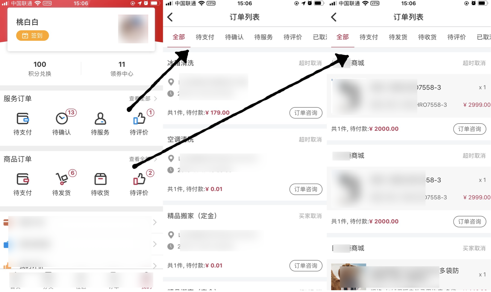
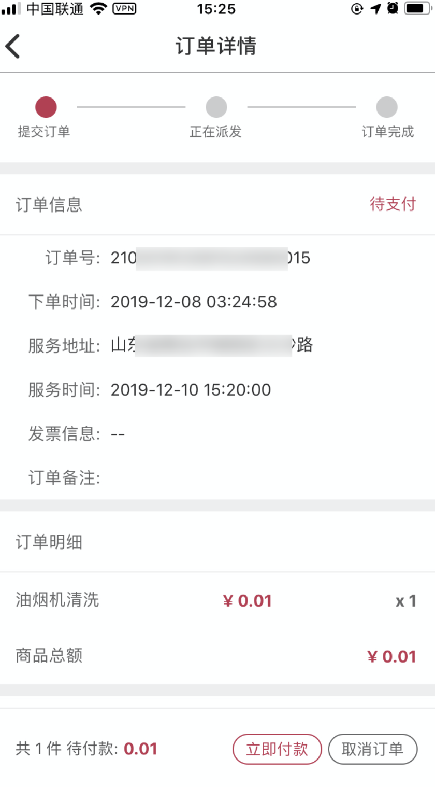

这样的业务逻辑页面, 在个人中心页面有**商品订单列表**和**服务订单列表**的入口, 点击不同的入口跳转到列表页面不同的 tab 上, 列表页面支持下拉刷新和上拉加载更多的功能, 点击某一订单跳转到**订单详情**页面:



在列表与详情页面都支持的操作有:

- 取消订单
- 确认收货/确认服务
- 支付
- 评价

这些操作的状态需要同步, 比如在**订单详情**页面进行了支付, 在列表页面也要更新成为支付成功状态.

于是设计成这样的方案:

### Reducer

```javascript
const INIT_STATE = {
  current: TAB[0],
  loading: true,
  allS: { page: 1, list: [] },
  allG: { page: 1, list: [] },
  unpayS: { page: 1, list: [] },
  unpayG: { page: 1, list: [] },
  unconfirmS: { page: 1, list: [] },
  undeliverG: { page: 1, list: [] },
  unserviceS: { page: 1, list: [] },
  unreceiveG: { page: 1, list: [] },
  unevaluateS: { page: 1, list: [] },
  unevaluateG: { page: 1, list: [] },
  cancelledS: { page: 1, list: [] },
  cancelledG: { page: 1, list: [] }
}
export default function(state = INIT_STATE, action) {
  switch (action.type) {
    case types.CHANGE: {
      return {
        ...state,
        ...action.payload
      }
    }
    default:
      return state
  }
}
```

它保存着当前 tab, 并且 tab 长这样:

```javascript
const TAB = {
  { status: -1, title: '全部', id: 0, value: 'allG' },
  { status: 0, title: '待支付', id: 1, value: 'unpayG' },
  { status: 105, title: '待发货', id: 2, value: 'undeliverG' },
//...
}
```

### Action

从个人中心不同入口跳转列表时候, 会触发一个 action:

```javascript
function changeTab(tab) {
  return {
    payload: {
      tab
    },
    type: types.CHANGE_TAB
  }
}
```

### Saga

`CHANGE_TAB` 这个 action 会被 saga 拦截并执行:

```javascript
function* handleChangeTab(action) {
  const { tab } = action.payload
  const { list } = yield select(state => state.orderList[tab.value])
  if (list.length === 0) {
    yield put({ type: types.CHANGE, payload: { current: tab, loading: true } })
    yield put({ type: types.SAGA_ORDER_LIST_FETCH, payload: tab })
  } else {
    yield put({
      type: types.CHANGE,
      payload: {
        current: tab,
        loading: false
      }
    })
  }
}
```

它会判断当前 tab 的数据是否为空, 如果不为空, 则说明了之前缓存过数据, 不需要进行额外处理, 只需要设置当前 tab; 如果数据为空, 那么就需要再发送一个 action: `SAGA_ORDER_LIST_FETCH` 来进行数据请求. 于是一个自带缓存功能的列表就完成了, 即使退出列表页, 再次进入列表不会进行重复的数据请求.


#### 关于分页请求

```javascript
function* handleFetch(action) {
  const { list, page } = yield select(state => state.orderList[tab.value])
  if (list.length === 0) {
    const { data } = yield call(api, 1)
    if (Array.isArray(data) && data.length > 0) {
      yield put({
        type: types.CHANGE,
        payload: {
          loading: false,
          [tab.value]: { page: 2, list: data }
        }
      })
    } else {
      yield put({ type: types.CHANGE, payload: { loading: false } })
    }
  } else {
    const { data } = yield call(api, page)
    if (Array.isArray(data) && data.length > 0) {
      yield put({
        type: types.CHANGE,
        payload: {
          loading: false,
          [tab.value]: {
            page: data.length === Api.pageSize ? page + 1 : page,
            list: list.concat(data)
          }
        }
      })
    } else {
      yield put({ type: types.CHANGE, payload: { loading: false } })
    }
  }
}
```

这里做的处理有:

- 判断列表是否为空
- 为空则请求第一页数据, 再将 page 设为2
- 不为空则请求当前 page 页数据, 再将 page + 1
- 判断返回数据是否为空, 代表着是否请求到 last page

### 列表页面的 mapState 和 mapDispatch

```javascript
const mapState = state => ({
  current: state.orderList.current,
  loading: state.orderList.loading,
  list: state.orderList[state.orderList.current.value].list
})
const mapDispatch = dispatch => ({
  changeTab: (tab, isForceUpdate) => dispatch(changeTabAction(tab, isForceUpdate)),
  loadMore: () => dispatch(fetchAction()),
  refresh: () => dispatch(refreshAction()),
  disaptchCancel: orderId => dispatch(cancelAction(orderId)),
  dispatchReceive: orderId => dispatch(receiveAction(orderId)),
  dispatchPay: (item, paytype) => dispatch(payAction(item, paytype))
})
```

### 详情页面的数据

```javascript
const mapState = (state, ownProps) => {
  const { navigation } = ownProps
  const orderId = navigation.getParam('orderId')
  if (orderId) {
    const { orderList } = state
    const l1 = orderList[orderList.current.value].list
    const cond = item => item.orderId === orderId
    const data = l1.find(cond)
    return {
      orderId,
      orderStatus: data.orderStatus
    }
  }
  return null
}

const mapDispatch = dispatch => ({
  disaptchCancel: orderId => dispatch(cancelAction(orderId)),
  dispatchReceive: orderId => dispatch(receiveAction(orderId)),
  dispatchPay: (item, paytype) => dispatch(payAction(item, paytype))
})
```

列表跳转详情只需要传递一个 `orderId` 过去, 详情页面就会去 store 里取相应的数据.

到此一个完整的功能就做完了. 但是由于业务逻辑的变更, 出现了一个棘手的问题, 先看以下页面被改为啥样:


个人中心页面订单入口取消掉, 取而代之新增一个**订单总页**, 这个页面会调用一个新的接口来获取订单, 订单是按照下单时间顺序来排列的. 订单总页上方有之前订单列表的入口. 所以麻烦来了: 现在要进行三个页面的数据状态同步, 比如一个比较极端的例子: 订单总页有订单A, 旧订单列表页也有订单A, 现在所在的页面是订单A的详情页面, 在详情页面点击支付, 那么支付成功后要更新订单总页与旧订单页面的数据状态.

## PlanA 订单总页不用 redux

因为新页面是顶级tab页, 所以想放弃 redux, 直接在 `didMount` 里请求数据, 再加上分页刷新等功能. 这里有两个问题要解决:

1. 点击跳转详情页, 详情页面数据怎么获取
2. 页面数据状态同步

问题1好解决, 增加一个 action: `HACK`, 当跳转详情时候, 先往之前 redux 列表里把订单塞进去. 但是问题2是不容易解决的, 只能解决一半, 当从新列表跳转详情时候, 清空旧的列表redux store, 这样旧列表始终是空的, 就没有同步问题了.

但是另一半, 如果详情页刚好是从旧列表页面跳转的, 该如何同步数据呢? 总不能把列表页给删掉吧? 而且新列表页的状态怎么同步?

## PlanB Combine Store

新的列表页面数据使用旧的列表页面的 redux 数据, 当新页面加载时候, 发送之前旧页面的 action, 再将数据按照时间顺序排列好. 这样共享同一份数据和 actions, 应该可以解决这个问题吧? 并不可行, 因为之前列表数据分为**服务**和**商品**两类, 没法保证按照时间排序时候页面数据呈线性, 可能服务的第一页需要塞到商品的第N页.

## PlanC 新建一个 reducer ✅

既然数据不能共享同一份, 那么就新建一个 reducer 来提供给新页面, 为了让数据保持同步, 需要和旧数据共享一些 actions:

```javascript
export function* watchOrderCalcel() {
  yield takeLatest(types.SAGA_ORDER_CANCEL, handleCancel)
}
export function* watchOrderReceive() {
  yield takeLatest(types.SAGA_ORDER_RECEIVE, handleReceive)
}
export function* watchOrderPay() {
  yield takeLatest(types.SAGA_ORDER_PAY, handlePay)
}
export function* watchOrderEvaluation() {
  yield takeLatest(types.SAGA_ORDER_EVALUATION, handleEvaluate)
}
```

这里几个 actions 是共享的, 在对应的 handler 中增加新 reducer 的适配, 比如:

```javascript
function* handlePay(action) {
  const { success } = yield call(payApi, action.payType)
  if (success) {
    yield put({ type: types.CHANGE, payload: { [tab]: { page: oldList[tab].page, list: oldList[tab].list.map(item => {
      if (item.orderId === action.payload) {
        return {
          ...item,
          orderStatus: 115
        }
      }
      return item
    })} }})
    // 以下是对新列表的适配
    yield put({
      type: types.ANOTHER_CHANGE,
      payload: {
        list: anotherList.map(item => {
          if (item.orderId === action.payload) {
            return {
              ...item,
              orderStatus: 115
            }
          }
          return item
        })
      }
    })
  }
}
```

对应的订单详情页面数据应该取自新列表或者旧列表:

```javascript
const mapState = (state, ownProps) => {
  const { navigation } = ownProps
  const orderId = navigation.getParam('orderId')
  if (orderId) {
    const { orderList, anotherOrderList } = state
    const l1 = orderList[orderList.current.value].list
    const l2 = anotherOrderList.list
    const cond = item => item.orderId === orderId
    const data = l1.find(cond) || l2.find(cond) // HERE
    return {
      orderId,
      orderStatus: data.orderStatus
    }
  }
  return null
}
```
