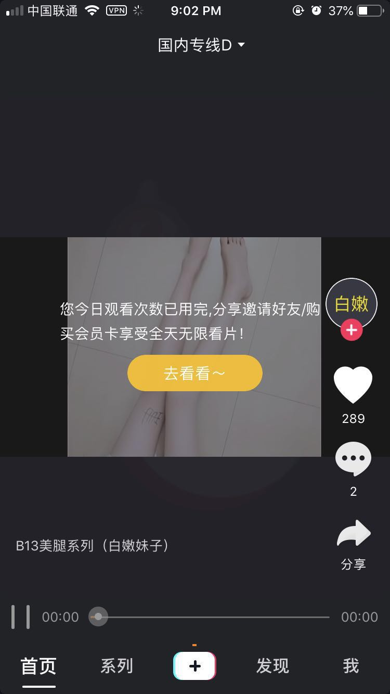
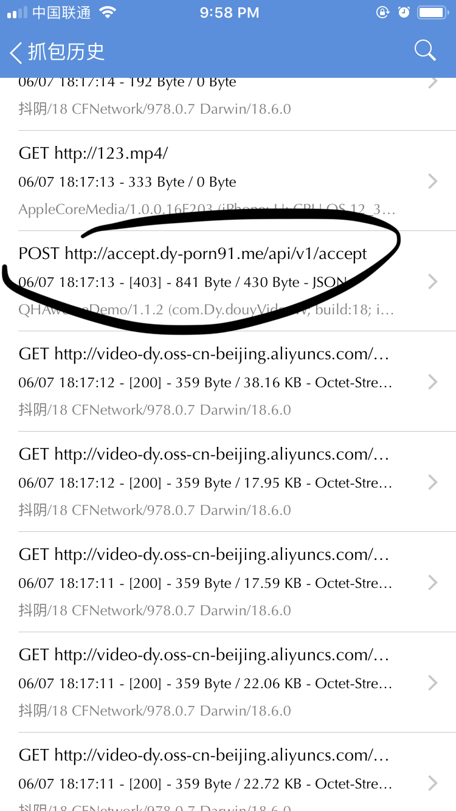
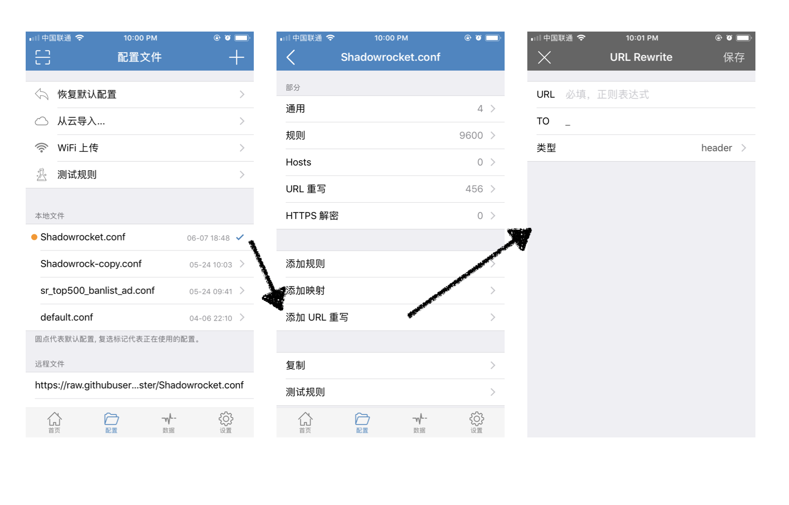
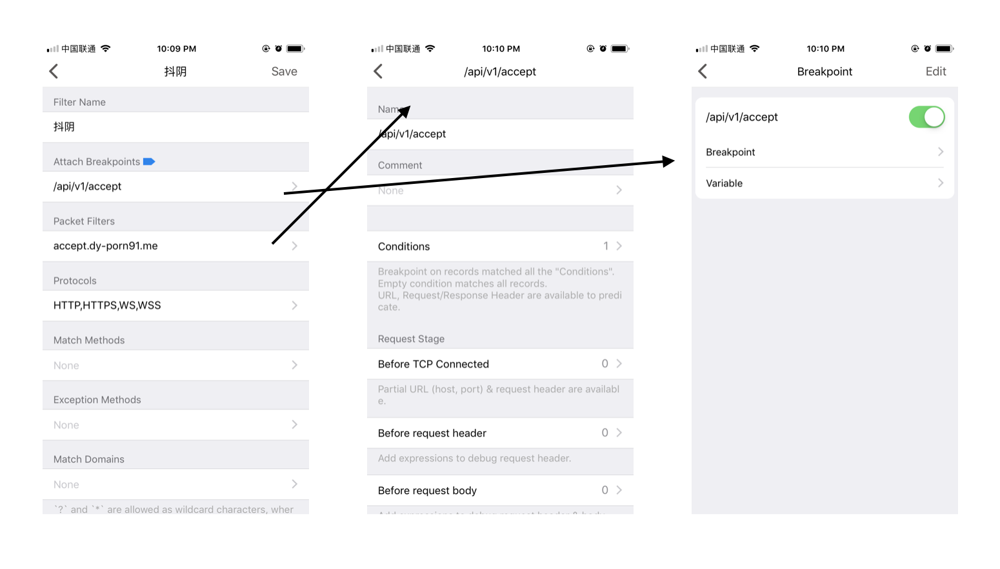
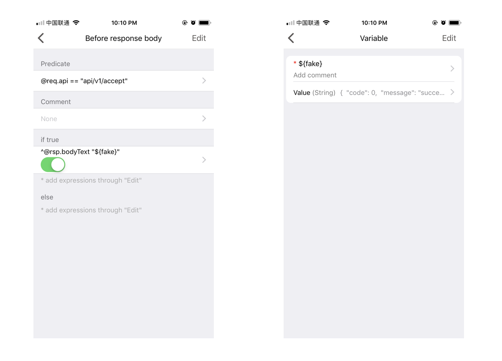
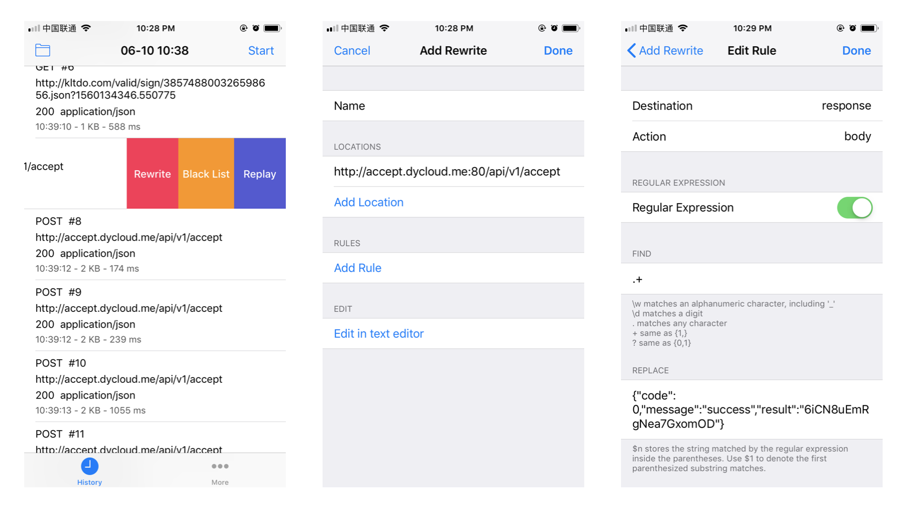

使用我的推广链接下载即可爽歪歪👉 http://sharedy.me/share/NFBZH

假期当我在愉快的看片时候图片遇到了下图：



瞬间有种上课看片被老师抓到的感觉, 突然一软.新用户每日在抖阴有10个片限制, 要解除这个限制, 正规途径有两种：

1. 推广此app, 让其他人也上车, 带上你的推广码
2. 花钱开会员, 这也是此app的盈利模式

看个片还有这么多限制, 还不如直接去 pornhub, xvideos 等网站.

但是看片还要抱个电脑挺费劲的, 并且外国黄色网站一般不符合口味, 筛选起来又太麻烦, 于是想想如何突破app的限制？

经过抓包可以看到每次欣赏一部片子之前都会经过一个接口请求：



```
http://accept.dy-porn91.me/api/v1/accept
```

这个接口正常返回是:

```
{"code":0,"message":"success","result":"6iCN8uEmRgNea7GxomOD"}
```

当每日次数用完后返回:

```
{
  "message" : "观影次数已用完",
  "code" : 403
}
```

于是方法就来了, 通过**修改接口返回来破解次数限制**.

## Mac + Charles

修改接口请求响应可以利用 mac 下的抓包工具： Charles.

抓包及断点调试步骤如下：

1. 手机装上 mac 下的证书(为了解密https包)
2. 电脑断开 shadowsocks
3. 手机与电脑链接同一 Wi-Fi
4. 手机 Wi-Fi 手动配置 proxy：mac ip + port8888
5. 打开Charles, 允许手机代理
6. 手机打开抖阴app, 浏览片子, 遇到`/api/v1/accept`接口403
7. 在Charles上右键此接口, 点击breakpoint
8. 再次浏览片子, 此时接口请求会被断点打到
9. 点击断点执行(第一步请求放开), 又回被断点打到(response请求断点)
10. 编辑 response, 将code改为0, 继续执行

此时就可以成功破解抖阴每日次数限制, 但是成本也是有的, 需要打开电脑, 打开Charles, 打断点, 编辑断点, 继续执行, 相信每个看片的人内心都是焦虑的, 没有耐心去操作如此复杂的步骤, 于是需要优化此步骤, 摆脱电脑.

## shadowrocket 也可以这么玩

手机上有一款神器：shadowrocket, 有4中代理模式：

1. 配置(PAC)
2. 全部走代理
3. 全部不走代理
4. 场景化自动选择是否走代理(比如4G/公司Wi-Fi/家里Wi-Fi/公共场合Wi-Fi等不同场景自动切换)

于是就想到了利用第一种配置模式, 将`/api/v1/accept`此接口代理转发到另一服务器：

1. 打开shadowrocket第二tab, 配置
2. 选择正在使用的配置文件, 编辑配置
3. 添加 URL 重写
4. 将抖阴`/api/v1/accept`接口转发到自己的一个server/api



经过测试此方法是可行的, 但是还是有点繁琐, 需要一台服务器来配合, 可能需要自己写个 server 或者自己配置 nginx, 于是就考虑有没有 iOS 应用支持 Charles 的断点功能？

## Thor 出场

一直久仰大名的 Thor 今天终于被我得以尝试, 肉疼的买下, 经过一系列的配置验证后, 终于可用：

1. 新建 session filter
2. 请求链接填写
3. 添加断点





解析：上图是对`/api/v1/accept`路径进行匹配, 如果在规则中, 则将其请求响应更改为变量 fake 的值, 这里的 fake 变量是我们伪造的 `{ code: 0 }`.

当然, Thor 也支持更加复杂的操作, 例如这个例子的请求也可以通过正则表达式来进行高级的替换.

Thor 教程中有一个非常不错的功能：[iOS 调试线上 app 中 WebView 的方法](https://github.com/PixelCyber/Thor/blob/master/tips-zh-Hans/breakpoint.md), 经过测试可以调试微信里的网页, 任何 app 里的 webview 等页面, 这些都是线上页面, 完美 hack, 其原理也是非常简单：在页面加载完成前, 经过 Thor, Thor 中对网页HTML进行js注入:

```
^@rsp.bodyText "<\/title>" "</title><script type='text/javascript' src='https://coding.net/u/Tumblr/p/thor-lib/git/raw/master/vconsole/3.2.0/vconsole.min.js'></script><script>new VConsole();</script>"

```

## 更好的替代品: HTTP Catcher

在 appstore 浏览 Thor 时候有推荐我 HTTP Catcher, 此应用介绍里有提到：**支持重写请求和响应**, 立马点击了购买.

在使用过程中也发现它和 Stream (抓包工具) 是一样轻量级的, 而相比之下实现同样功能的 Thor 就复杂的多.

于是具体过程如下：

1. 打开 HTTP Catcher, 配置好抓包
2. 浏览抖阴片子, 遇到403接口, 左滑点击 rewrite
3. 点击添加规则
4. 规则配置如图
5. 保存运行



上图中编辑规则, 将请求响应通过正则`.+`匹配替换所有为`{ code: 0 }`.


写到最后, 只想说:「我只是想看个片而已」
