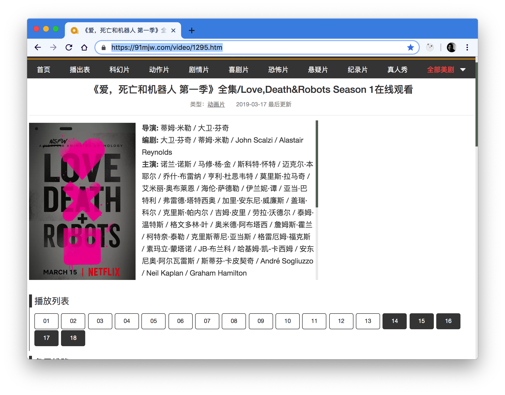
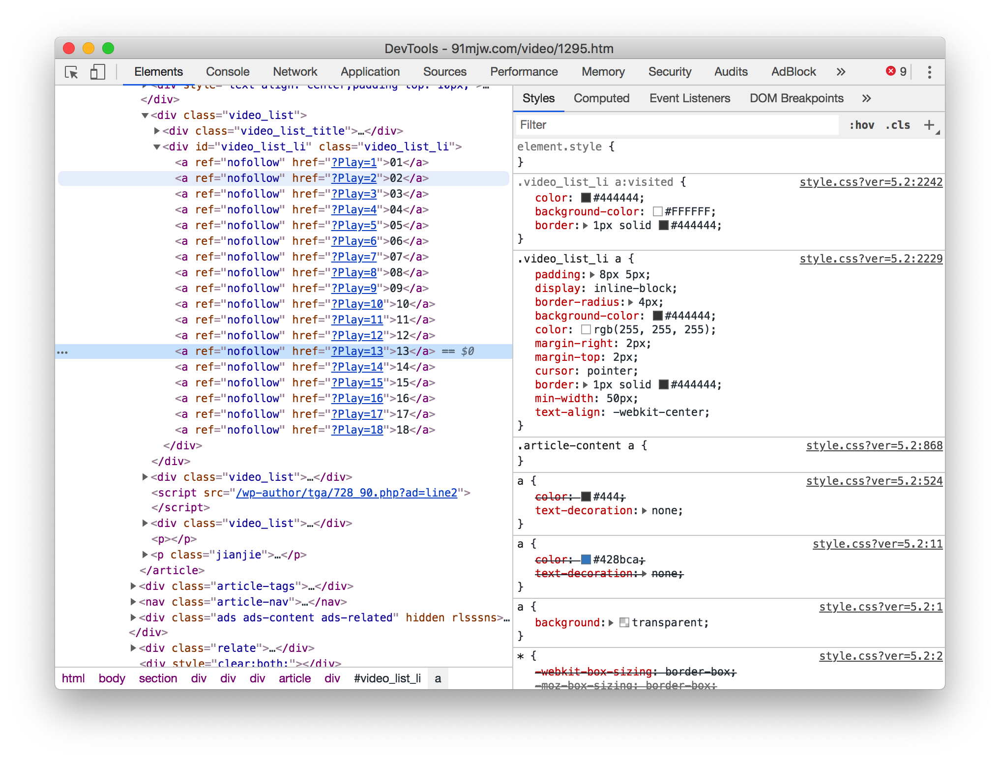

有这样一个看美剧的[网站](https://91mjw.com/video/1295.htm), 有个功能非常妙, 可以记住用户看到多少集



大脑一运转, 就可以猜到, 必定是将看的集数给记录下来, 于是去 `localStorage` 验证一下


结果发现空空如也, 那么去其他可存储的地方 `(IndexedDB, WebSQL)` 看下, 结果都没有找到存储的地方.

这就勾起了我的好奇心, 于是去 `html` 里看下这些集数 `tag` 的 `class`, 清一色的 `nofollow`


```html
<div id="video_list_li" class="video_list_li">
  <a ref="nofollow" href="?Play=1">01</a>
  <a ref="nofollow" href="?Play=2">02</a>
  <a ref="nofollow" href="?Play=3">03</a>
  <a ref="nofollow" href="?Play=4">04</a>
  <a ref="nofollow" href="?Play=5">05</a>
  <a ref="nofollow" href="?Play=6">06</a>
  <a ref="nofollow" href="?Play=7">07</a>
  <a ref="nofollow" href="?Play=8">08</a>
  <a ref="nofollow" href="?Play=9">09</a>
  <a ref="nofollow" href="?Play=10">10</a>
  <a ref="nofollow" href="?Play=11">11</a>
  <a ref="nofollow" href="?Play=12">12</a>
  <a ref="nofollow" href="?Play=13">13</a>
  <a ref="nofollow" href="?Play=14">14</a>
  <a ref="nofollow" href="?Play=15">15</a>
  <a ref="nofollow" href="?Play=16">16</a>
  <a ref="nofollow" href="?Play=17">17</a>
  <a ref="nofollow" href="?Play=18">18</a>
</div>
```

于是真相大白, 浏览器自带的 `<a>` 标签 `visited` 属性是可以记录用户已点击, 加点样式就可以表达出图片中效果.



平时用 `react/vue` 开发时很少用 `<a>` 标签, 许多功能原生 `html` 就可以实现, 并且没有兼容问题, 也避免了 `js` 的执行出错. 框架会框住开发者的思想, 要时刻明白, 框架没有啥好学习的, 真正要学的东西不在框架上.
