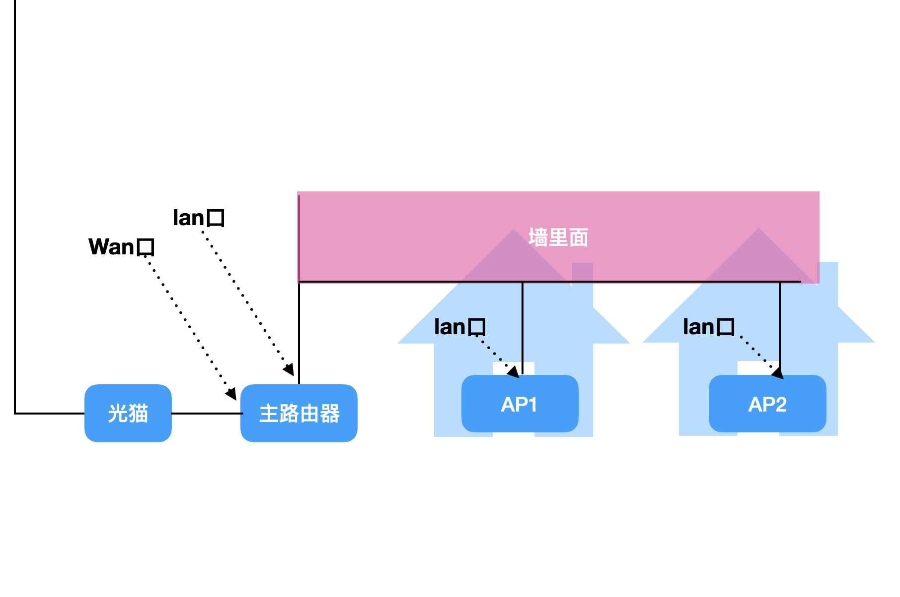

如果房子够大, 墙面够厚, 就需要多买一个路由器来增强信号.

一个路由器是有很多种上网模式的, 首先家里需要一个光猫, 将路由器的 Wan 口连接光猫,
这样路由器就可以上网了. 这种模式是**Router（无线路由）模式**.

但是一个路由器不够, 因为房子太大了, 需要加几个路由器.

## AP 模式

路由器都有 AP 模式, 也有单独的 AP路由器吧..

在 AP 模式下, 连接路由器的 lan 口, 它会自动放大主路由的信号.

## Repeater (中继) 模式

如果不用有线连接 AP 模式下的路由器, 就变成了**中继模式**.

## Bridge (桥接) 模式

上面的中继模式保持主路由的无线名称, 在 Bridge 模式下是新的无线名称.

## Mesh

Mesh 和中继/AP类似, 可以用有线扩展, 也可以用无线扩展,
上面的那些模式扩展都需要在路由器后台进行复杂的配置, 比如 SSID, 密码,
上级路由等等. 而 Mesh 简便的很. 但也需要路由器支持 Mesh 组网功能.

