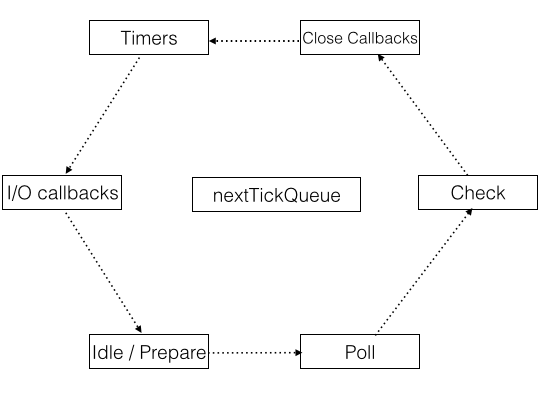

[原文地址](http://voidcanvas.com/setimmediate-vs-nexttick-vs-settimeout/)

几天前, 我在教 node 新手如何使用异步, 当时我们在讨论 node 一些异步 apis. 我在 google 上想给他们找一些参考引用, 但是惊讶的发现, 网上关于 `setImmediate()` 和 `process.nextTick()` 的大多数的文章是不靠谱并且具有一定的误导性的. 并且如果让一些非高级开发人员去查阅 node 官方文档不是很现实. 因此本篇就诞生了.

## 哪些误区

在我描述任何东西之前, 我想先澄清一下其他文章在此话题下的误区. 如果你没有被误导, 那么就可以跳过这一节.

#### setImmediate() 总是执行在 setTimeout(fn, 0) 之前

这是一个最常见的误解, 我会在本篇后文中讨论这个概念, 但是以下是对这个错误观点的证明:

```javascript
// index.js
setTimeout(function(){
  console.log("SETTIMEOUT");
});
setImmediate(function(){
  console.log("SETIMMEDIATE");
});

// run it
// node index.js
```

如果这个观点是正确的, 那么执行这个代码将给出的结果是 *SETIMMEDIATE* 总是先于 *SETTIMEOUT* 打印.
然而现实是你执行这个代码, 结果是不可预见的, 你多次执行这个代码会发现有不同的打印顺序.


#### setImmediate() 会将回掉放到事件队列的最前面

```javascript
// index.js
setTimeout(function() {
    console.log("TIMEOUT 1");
    setImmediate(function() {
        console.log("SETIMMEDIATE 1");
    });
}, 0);
setTimeout(function() {
    console.log("TIMEOUT 2");
    setImmediate(function() {
        console.log("SETIMMEDIATE 2");
    });
}, 0);
setTimeout(function() {
    console.log("TIMEOUT 3");
}, 0);

// run it
// node index.js
```

如果这个观点是正确的, 那么执行结果会是:

```
TIMEOUT 1
SETIMMEDIATE 1
TIMEOUT 2
SETIMMEDIATE 2
TIMEOUT 3
```

但实际上不管你执行多少次, 执行结果总是:

```
TIMEOUT 1
TIMEOUT 2
TIMEOUT 3
SETIMMEDIATE 1
SETIMMEDIATE 2
```

#### nextTick() 会在下次事件迭代时候触发回掉

实际上 `process.nextTick()` 和 `setImmediate()` 的命名是错误的. 如果我们交换以下这两者的名字概念, 那么就是正确的解释了.
然而在 JavaScript 当中不会取消和改变 api 名字的, 因此这个命名一直是错误的.

从功能上讲, `process.nextTick()` 实际上是**立即**触发一个回掉. `setImmediate()` 的回掉会被本次或下次事件迭代触发.

## Node.js 的事件循环是如何工作的

要了解它的工作过程和这三个函数区别的唯一方法是了解**事件循环**的运作过程. 希望你已了解事件循环是处理异步回掉的, 而这里将讨论它是如何工作的.


这篇是对**事件循环**做了一个简短的描述, 如果你想更详细的了解它, 你可以阅读[这篇深入事件循环结构和原理的文章](http://voidcanvas.com/nodejs-event-loop/).





在图标中每个小长方形代表这一个阶段, 并且**事件循环**会在这些阶段不断地重复, 从 `timer` 阶段到 `close callbacks` 阶段.
中间有一个 `nextTickQueue`, 然而它本身不是**事件循环**当中的一份子.
每个阶段都附有一个队列. 当**事件循环**到达一个指定阶段时, node 将会执行在队列中的回掉或任务. 下面是对阶段的一段简短描述.

- **Timer**: 它处理经过指定时间后的 `setTimeout` 和 `setInterval` 回掉.
- **I/O callbacks**: 处理除了 `setTimeout`, `setInterval` 和 `setImmediate` 之外的所有的回掉. 它也不会处理 `close callbacks`.
- **Idle, prepare**: 系统内部调用.
- **Pole**: 检索新的 I/O 事件, 这正是 node 吸引人的地方.
- **Check**: 处理 `setImmediate` 的回掉.
- **Close callbacks**: 处理所有*关闭*回掉等, 比如 `socket` 连接关闭.
- **nextTickQueue**: 持有 `process.nextTick()` 的回掉, 但它不属于**事件循环**的一部分.

#### 事件循环是如何传递的

首先它先到达 `Timer` 阶段, 检查 `timer` 队列中是否有回掉. 如果有回掉, 它会一个接一个的执行直到队列为空或者到达最大执行界限.

然后到达 `I/O callback` 阶段, 它也会去 i/o 队列里寻找. 它遵循和 `timer` 相同的方式, 任务执行完毕进入下一个阶段.

`Idle` 阶段是 node 内部使用的, 比如 *preparation* 等.  在这之后, **事件循环**将会到达 `Poll` 阶段, 它会处理事件. 如果没有事件要处理, **事件循环**会在 `Poll` 阶段等候新 i/o 事件的到来. 当在 `Poll` 阶段等候或进入 `sleep` 状态时候, **事件循环**不会有任何动作. 然而如果 `setImmediate` 在这里执行的话, **事件循环**将会结束 **Poll** 阶段, 继续到 **Check** 阶段去执行这些预定方法.

在 `Check` 阶段结束后, **事件循环**将会尝试执行 `Close` 回掉, 在这之后它又会回到 `Timer` 阶段来进行下一次迭代.

`nextTickQueue` 出场了. 任何 `process.nextTick()` 里的回掉都会放入 `nextTickQueue` 队列里, 并且**事件循环**将会一个一个执行它们, 直到整个队列被执行完毕. 不管是在哪一个阶段, `nextTickQueue` 队列总会插队到当前正在执行的阶段(*ongoing operation*)之后.

这里是对**事件循环**的一个概论, 现在我们可以尝试理解本篇中的三个 apis.


## setImmediate()

首先, 我们已经了解了**事件循环**的工作过程, 可以说 `setImmediate()` 对于 `immediate` 不是很恰当, 但是它队列里的回掉会在每次事件迭代中被执行(发生在 `Check` 阶段).

`Timer` 阶段有一个额外的排序工作, 它会花额外的事件来注册. 所以, 上面前一个例子中结果是不可预料的, 因为它取决于当前进程的执行状况. 如果我们将这块代码放到 `I/O` 回掉里, 那么就可以确定 `setImmediate` 的回掉先于 `setTimeout` 执行.

```javascript
// index.js
var fs = require('fs');
fs.readFile("my-file-path.txt", function() {
    setTimeout(function(){
        console.log("SETTIMEOUT");
    });
    setImmediate(function(){
        console.log("SETIMMEDIATE");
    });
});

// run it
// $ node index.js
```

```bash
# output (always)
SETIMMEDIATE
SETTIMEOUT
```

## setTimeout(fn,0)

`setTimeout(fn,0)` 触发执行回掉的时机是直到**事件循环**进入到 `Timer` 阶段. 而且只有在 `Close callback` 阶段我们才可以保证 `setTimeout(fn, 0)` 会先于 `setImmediate()` 执行. 于是你要将**事件循环**的这张图标深深印在你的脑海中, 你就可以清楚的知道到底 `setTimeout(fn, 0)` 和 `setImmediate()` 的执行是谁先谁后.

## process.nextTick()

Node.js 文章中总会看到这句话:

> `nextTickQueue` will be processed after the current operation completes, regardless of the current phase of the event loop.

`nextTickQueue` 将会插入到当前操作结束后, 不管当前处于**事件循环**的哪一个阶段.

意思是说, 无论到达 js 和 c/c++ 的哪一种边界, 此队列都将会被执行. 因此它不仅仅是说在当前阶段任务完成后执行, 也不意味着执行完当前回掉立马执行. 它是在下一阶段到达之前的某一时刻执行.